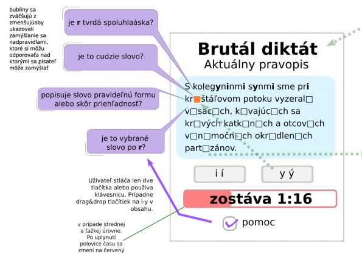

# Diktatik
Diktatik na GitHube je priestor pre zdrojové kódi aplikacií na testovanie slovenskeho pravopisu so zameranim na pisanie ipsilonu a joti (makkeho i). Jeho cieľom je ukázať ľuďom, ktorí su presvedčení, že 100% ovládajú pravopis a pri písaní ich nezdržuje rozmíšľanie nad tím, ake i sa kde píše.

Viac info na [ipsilon.sk - Ako môžete pomôcť / Diktátik](https://ypsilon.sk/brutal-diktat-vyvoj-aplikacie/)
